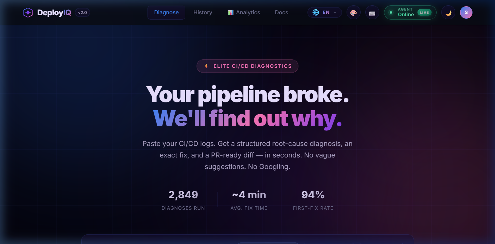
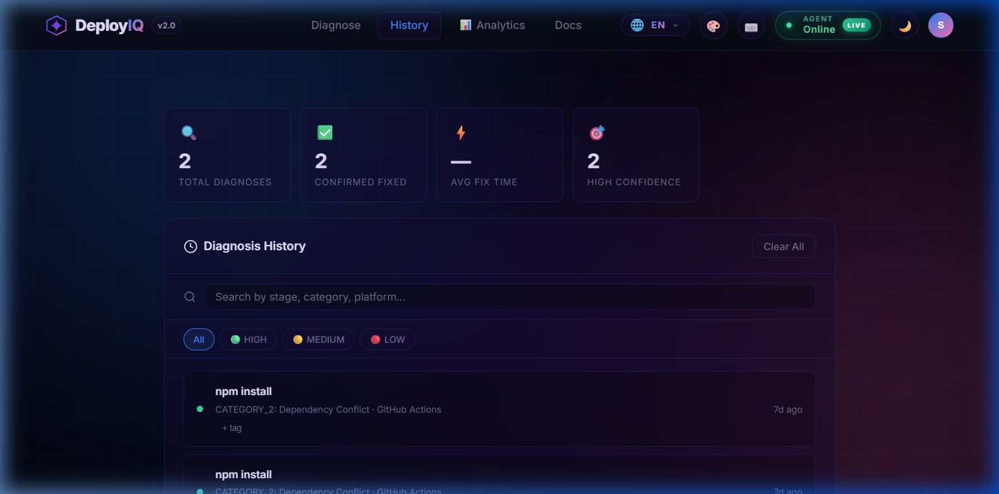
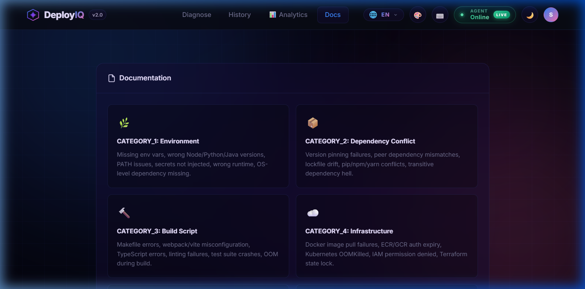
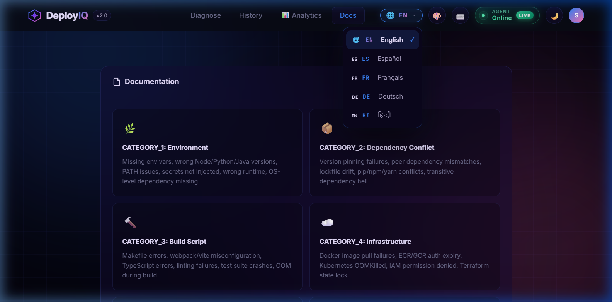
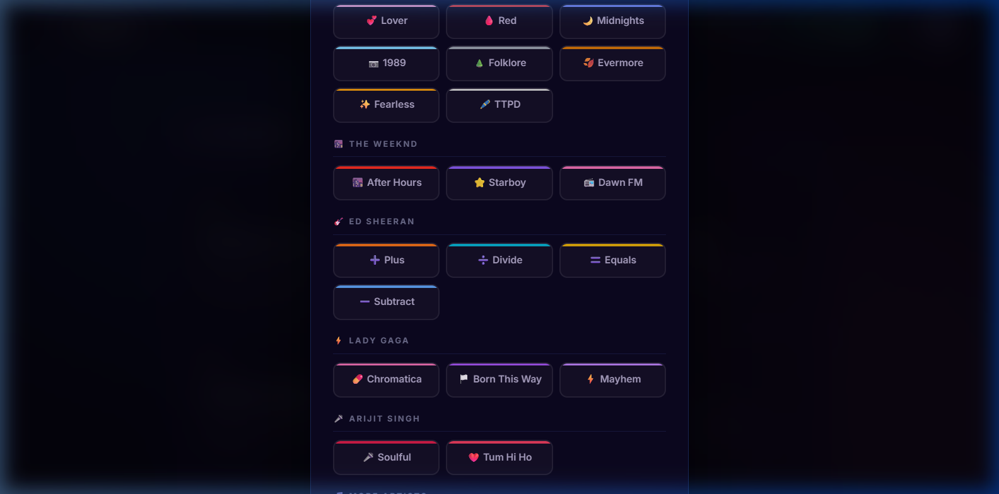

<div align="center">

<!-- Animated Banner -->


<!-- Animated typing headline -->
<a href="https://github.com/Suraj-kummar/DeployIQ">
  
</a>

<br/>

<!-- Core badges row -->
<p align="center">
  <a href="https://fastapi.tiangolo.com"></a>
  &nbsp;
  <a href="https://python.org"></a>
  &nbsp;
  <a href="https://supabase.com"></a>
  &nbsp;
  <a href="https://anthropic.com"></a>
  &nbsp;
  <a href="https://docker.com"></a>
</p>

<!-- Status badges row -->
<p align="center">
  
  &nbsp;
  
  &nbsp;
  
  &nbsp;
  
  &nbsp;
  
</p>

<!-- Live GitHub stats -->
<p align="center">
  
  &nbsp;
  
  &nbsp;
  
  &nbsp;
  
</p>

</div>

---

<div align="center">

## 🌟 What is DeployIQ?

</div>

> **DeployIQ** is an AI-powered CI/CD debugging assistant that autonomously diagnoses pipeline failures.  
> Engineers spend hours staring at cryptic logs — **DeployIQ reads them in milliseconds**, identifies the root cause, and hands back actionable fix steps, exact commands, and even a ready-to-commit **PR diff**.

**Built for teams.** Every diagnosis is stored, embedded, and used to surface similar past fixes — so the **same error is never debugged twice.**

<div align="center">

```
╔══════════════════════════════════════════════════════════╗
║   2,850+ Diagnoses · 94% First-Fix Rate · ~4 min avg    ║
╚══════════════════════════════════════════════════════════╝
```

</div>

---

## 📸 Screenshots

<div align="center">

| 🏠 Diagnose | 📊 History |
|:---:|:---:|
|  |  |

| 📄 Docs | 🌐 Multi-Language |
|:---:|:---:|
|  |  |



*🎨 Artist Themes — personalize your DeployIQ experience*

</div>

---


## 🎬 How It Works

<div align="center">

| &nbsp;&nbsp;Step&nbsp;&nbsp; | &nbsp;&nbsp;Action&nbsp;&nbsp; | Details |
|:---:|:---|:---|
| **1️⃣** | **Paste Logs** | Raw CI/CD output from GitHub Actions, Jenkins, GitLab CI, CircleCI, etc. |
| **2️⃣** | **Select Platform** | Tell DeployIQ which CI system you're running |
| **3️⃣** | **AI Agent Runs** | 4-step LangGraph pipeline: **Observe → Classify → Diagnose → Format** |
| **4️⃣** | **Get Your Fix** | Structured root cause, step-by-step commands, and PR-ready diff |
| **5️⃣** | **Give Feedback** | Did the fix work? The system learns from your team's history |

</div>

---

## 🏗️ Architecture

<div align="center">

```
┌──────────────────────────────────────────────────────────────┐
│                    🖥️  Frontend (HTML/CSS/JS)                │
│  index.html  •  app.js  •  styles.css  •  styles-extra.css  │
└───────────────────────────┬──────────────────────────────────┘
                            │  REST (JSON)
                            ▼
┌──────────────────────────────────────────────────────────────┐
│               ⚡  FastAPI Backend  (Python 3.11)              │
│                                                              │
│  /api/auth      → JWT verification via Supabase             │
│  /api/teams     → Team management (create, assign, stats)   │
│  /api/pipeline  → Webhook → Diagnose → Store → Embed        │
└────────────────────┬─────────────────────────────────────────┘
                     │
       ┌─────────────┼──────────────────┐
       ▼             ▼                  ▼
┌─────────────┐ ┌──────────────┐  ┌───────────────┐
│  🤖 LangGraph│ │ 🗄️ Supabase  │  │  🔢 OpenAI    │
│  AI Agent   │ │  Postgres    │  │  Embeddings   │
│             │ │  pgvector    │  │  text-embed   │
│  Observe    │ │  Auth        │  │  -3-small     │
│  → Claude ✨│ │  Realtime    │  └───────────────┘
│  → Mistral  │ └──────────────┘
│  → Format   │
└─────────────┘
```

</div>

### 🔁 AI Diagnosis Pipeline (LangGraph)

The agent runs a **deterministic 4-node state graph**:

```
observe → diagnose_claude ──(success)──→ format_output → ✅ END
                          ──(rate limit)→ diagnose_mistral → format_output → ✅ END
```

<div align="center">

| Node | Role |
|:---:|:---|
| `🔍 observe` | Strips noise from raw logs; keeps ERROR/FAILED/exception lines + 2 lines of context |
| `🧠 diagnose_claude` | Calls Claude Sonnet 4.5 with compressed logs + team's past fixes as context |
| `🌀 diagnose_mistral` | Automatic fallback to Mistral Small on Claude rate-limit (429) |
| `📋 format_output` | Builds the final structured, human-readable diagnosis |

</div>

---

## 📁 Project Structure

```
📦 DeployIQ/
├── 🌐 index.html              # Main frontend entry point
├── ⚙️  app.js                  # Frontend logic (vanilla JS)
├── 🎨 styles.css              # Core design system
├── ✨ styles-extra.css        # Extended UI components & animations
├── 🔧 config.js               # Frontend configuration
├── 📋 requirements.txt        # Python dependencies
├── 🐳 Dockerfile              # Multi-stage Docker build
├── 🐳 docker-compose.yml      # Local dev: API (8000) + Frontend (5500)
├── ☁️  render.yaml             # One-click Render.com deployment
├── 🚂 railway.toml            # Railway.app deployment config
├── 🔑 generate_config.py      # Config generator utility
├── 📄 .env.example            # Environment variable template
│
├── 🗂️  backend/
│   ├── main.py               # FastAPI app factory — wires routers + CORS + lifespan
│   ├── agent/
│   │   └── graph.py          # LangGraph state machine (Observe → Diagnose → Format)
│   ├── routes/
│   │   ├── auth.py           # Supabase JWT verification + /api/auth endpoints
│   │   ├── pipeline.py       # Webhook receiver + diagnosis orchestration
│   │   └── teams.py          # Team CRUD + member assignment
│   └── db/
│       ├── supabase_client.py  # Supabase client singleton
│       └── repository.py       # All DB read/write operations (single source of truth)
│
├── 🗃️  supabase/              # Supabase migrations & SQL functions
└── 📂 src/
    ├── hooks/                # Frontend custom hooks
    └── lib/                  # Shared frontend utilities
```

---


## 🚀 Getting Started

### Prerequisites

<p>


</p>

### 1️⃣ Clone & Set Up

```bash
git clone https://github.com/your-username/DeployIQ.git
cd DeployIQ

# Copy the environment template
cp .env.example .env
```

### 2️⃣ Configure `.env`

```env
# ── Supabase ──────────────────────────────────────────────────
SUPABASE_URL=https://xxxxxxxxxxxx.supabase.co
SUPABASE_ANON_KEY=eyJ...             # safe to expose in browser
SUPABASE_SERVICE_ROLE_KEY=eyJ...     # NEVER expose — backend only

# ── Frontend (Vite) ───────────────────────────────────────────
VITE_SUPABASE_URL=https://xxxxxxxxxxxx.supabase.co
VITE_SUPABASE_ANON_KEY=eyJ...

# ── AI Models ─────────────────────────────────────────────────
OPENAI_API_KEY=sk-...                # for text-embedding-3-small
ANTHROPIC_API_KEY=sk-ant-...         # for Claude Sonnet 4.5

# ── Webhook Security ──────────────────────────────────────────
WEBHOOK_SECRET=your-random-secret   # shared with GitHub Actions / Jenkins

# ── Optional ──────────────────────────────────────────────────
MISTRAL_API_KEY=...                  # automatic fallback LLM
SLACK_BOT_TOKEN=xoxb-...            # Slack notifications
```

### 3️⃣ Run with Docker *(Recommended)*

```bash
docker-compose up --build
```

<div align="center">

| Service | URL |
|:---|:---|
| ⚡ FastAPI Backend | http://localhost:8000 |
| 📖 API Docs (Swagger) | http://localhost:8000/docs |
| 🌐 Frontend | http://localhost:5500 |

</div>

### 4️⃣ Run Locally (Without Docker)

```bash
# Create and activate virtual environment
python -m venv venv
venv\Scripts\activate          # Windows
# source venv/bin/activate     # macOS/Linux

# Install dependencies
pip install -r requirements.txt

# Start FastAPI
uvicorn backend.main:app --reload --port 8000
```

---

## 📡 API Reference

### Health Check

```http
GET /health
→ { "status": "ok", "version": "2.0.0" }
```

### 🔐 Authentication

```http
GET  /api/auth/me        → Returns current user profile (requires Bearer token)
GET  /api/auth/session   → Lightweight session validity check
```

### 🔀 Pipeline

<div align="center">

| Method | Endpoint | Description |
|:---:|:---|:---|
| `POST` | `/api/pipeline/webhook` | Receive a CI/CD failure event — runs full diagnosis |
| `GET` | `/api/pipeline/failures/{team_id}` | List recent failures for a team |
| `GET` | `/api/pipeline/diagnoses/{team_id}` | List recent diagnoses |
| `GET` | `/api/pipeline/diagnosis/{diagnosis_id}` | Fetch a single diagnosis |
| `GET` | `/api/pipeline/stats/{team_id}` | Team-level statistics |
| `POST` | `/api/pipeline/feedback` | Submit fix feedback (worked: true/false) |

</div>

#### Webhook Payload Example

```json
POST /api/pipeline/webhook
X-Webhook-Secret: your-random-secret

{
  "team_id": "uuid-of-your-team",
  "repo_url": "https://github.com/org/repo",
  "platform": "github_actions",
  "failed_stage": "build",
  "raw_logs": { "run_id": "12345", "logs": "..." },
  "compressed_logs": "Error: Cannot find module 'react'\n  at Function.Module..."
}
```

#### Diagnosis Response

```json
{
  "failure_id": "uuid",
  "diagnosis_id": "uuid",
  "confidence": "HIGH",
  "root_cause": "Missing peer dependency 'react' not installed before build step."
}
```

### 👥 Teams

<div align="center">

| Method | Endpoint | Description |
|:---:|:---|:---|
| `POST` | `/api/teams/` | Create a new team (caller becomes admin) |
| `GET` | `/api/teams/{team_id}` | Get team info |
| `GET` | `/api/teams/{team_id}/members` | List team members |
| `POST` | `/api/teams/{team_id}/assign` | Assign a user to a team |
| `GET` | `/api/teams/{team_id}/stats` | Diagnosis statistics for a team |

</div>

---

## 🧠 Diagnosis Categories

The AI classifies every failure into one of **6 categories**:

<div align="center">

| 🏷️ Category | 📝 Description |
|:---|:---|
| 🔴 `dependency_conflict` | Package version mismatches, missing deps |
| 🟠 `environment_misconfiguration` | Missing env vars, wrong runtime versions |
| 🟡 `build_script_failure` | Errors in npm/make/gradle/etc. scripts |
| 🟢 `infrastructure_error` | Container/runner/resource issues |
| 🔵 `network_external` | Timeout or connectivity to external services |
| 🟣 `test_quality_gate` | Test failures blocking the pipeline |

</div>

---

## 🗄️ Database Schema (Supabase)

<div align="center">

| Table | Purpose |
|:---|:---|
| `users` | Auth users + team assignment + role |
| `teams` | Team profiles with slugs |
| `pipeline_failures` | Raw CI/CD failure events |
| `diagnoses` | Structured AI diagnosis results |
| `fix_embeddings` | pgvector embeddings for semantic similarity search |
| `fix_feedback` | User feedback on whether a fix worked |
| `team_diagnosis_stats` | Materialized view for team statistics |

</div>

### 🔍 Semantic Similarity Search

When a new failure comes in, DeployIQ:

1. **Embeds** compressed logs using `text-embedding-3-small` (1536 dims)
2. **Searches** via the `match_similar_fixes` Postgres function (pgvector)
3. **Injects** up to 3 past fixes (similarity ≥ 0.70) as context into the Claude prompt

> 🧬 This means the AI **learns from your team's history** and gets more accurate over time.

---


## ☁️ Deployment

### Render.com *(One-Click)*

[](https://render.com)

The `render.yaml` is pre-configured. Just connect your repo and set the environment variables in the Render dashboard.

### 🚂 Railway.app

```bash
# Install Railway CLI
npm install -g @railway/cli

railway login
railway up
```

Set env vars via the Railway dashboard or `railway variables set KEY=VALUE`.

### ⚙️ GitHub Actions CI/CD Integration

Add this step to your existing workflow to send failure events to DeployIQ:

```yaml
- name: Notify DeployIQ on failure
  if: failure()
  run: |
    curl -X POST "${{ secrets.DEPLOYIQ_API_URL }}/api/pipeline/webhook" \
      -H "Content-Type: application/json" \
      -H "X-Webhook-Secret: ${{ secrets.DEPLOYIQ_WEBHOOK_SECRET }}" \
      -d '{
        "team_id": "${{ secrets.DEPLOYIQ_TEAM_ID }}",
        "repo_url": "${{ github.server_url }}/${{ github.repository }}",
        "platform": "github_actions",
        "failed_stage": "${{ github.job }}",
        "raw_logs": {},
        "compressed_logs": "Build failed in job: ${{ github.job }}"
      }'
```

---

## 🔒 Security

<div align="center">

| 🛡️ Feature | Details |
|:---|:---|
| **JWT Validation** | Every protected endpoint validates the Supabase Bearer token via `get_current_user` |
| **Webhook Secret** | `/api/pipeline/webhook` validates `X-Webhook-Secret` header against `WEBHOOK_SECRET` env var |
| **Non-root Docker** | Container runs as dedicated `deployiq` user (UID 1001) |
| **Service Role Key** | `SUPABASE_SERVICE_ROLE_KEY` is only used server-side — never exposed to frontend |
| **CORS** | Controlled via `ALLOWED_ORIGINS` env var — defaults to `localhost` only |

</div>

---

## 🛠️ Tech Stack

<div align="center">

| Layer | Technology |
|:---|:---|
| 🖥️ **Frontend** | HTML5, Vanilla CSS, Vanilla JS |
| ⚡ **Backend** | Python 3.11, FastAPI 0.111, Uvicorn |
| 🤖 **AI Agent** | LangGraph 0.1.5, Claude Sonnet 4.5 (Anthropic), Mistral Small (fallback) |
| 🔢 **Embeddings** | OpenAI `text-embedding-3-small` (1536 dims) |
| 🗄️ **Database** | Supabase (PostgreSQL + pgvector + Auth + Realtime) |
| 🔐 **Auth** | Supabase Auth (Email OTP / OAuth / Google) |
| 🐳 **Containers** | Docker (multi-stage), Docker Compose |
| ☁️ **Deployment** | Render.com, Railway.app, Vercel |
| ✅ **Validation** | Pydantic v2 |

</div>

<div align="center">

<p>
  
  
  
  
  
  
  
  
  
  
</p>

</div>

---

## ❓ FAQ

<details>
<summary><b>💰 Is DeployIQ free to use?</b></summary>

Yes! DeployIQ is open source under the MIT License. You only pay for your own API usage (Anthropic/OpenAI keys) and your hosting (Render free tier works).

</details>

<details>
<summary><b>🔐 Are my CI/CD logs sent to third parties?</b></summary>

Your logs are sent to the Anthropic API (Claude) for diagnosis. They are not stored by Anthropic. Within your own deployment, logs are stored in your private Supabase database only.

</details>

<details>
<summary><b>📦 Which CI/CD platforms are supported?</b></summary>

Currently via webhook: **GitHub Actions**, **GitLab CI**, **Jenkins**, **CircleCI**, **Bitbucket Pipelines**, and any platform that can fire an HTTP POST on failure. Native integrations for GitLab CI and Jenkins are on the roadmap.

</details>

<details>
<summary><b>🤖 What if Claude is rate-limited?</b></summary>

DeployIQ automatically falls back to **Mistral Small** when Claude returns a 429. Set `MISTRAL_API_KEY` in your `.env` to enable it.

</details>

<details>
<summary><b>🌍 Can I self-host DeployIQ?</b></summary>

Absolutely. Run `docker-compose up --build` and you're done. Everything is containerized and environment-variable-driven.

</details>

---

## 🗺️ Roadmap

<div align="center">

| Status | Feature |
|:---:|:---|
| ✅ | LangGraph 4-node diagnosis pipeline |
| ✅ | Claude Sonnet 4.5 + Mistral fallback |
| ✅ | Supabase Auth (Email OTP + Google OAuth) |
| ✅ | pgvector semantic similarity search |
| ✅ | Multi-language UI (EN / ES / FR / DE / HI) |
| ✅ | Artist-inspired UI themes |
| ✅ | Diagnosis history & team stats dashboard |
| ✅ | GitHub Actions CI/CD webhook integration |
| 🔄 | VS Code extension for inline log diagnosis |
| 🔄 | Slack bot — `/diagnose` slash command |
| 🔄 | GitLab CI native integration |
| 🔄 | Jenkins plugin |
| 🔄 | AI-generated PR diff auto-commit |
| 🔄 | Org-level analytics dashboard |

</div>

---

## 🤝 Contributing

Contributions are welcome! Here's how to get started:

1. 🍴 **Fork** the repository
2. 🌿 **Create** a feature branch: `git checkout -b feat/your-feature`
3. 💬 **Commit** your changes: `git commit -m 'feat: add your feature'`
4. 📤 **Push** to your branch: `git push origin feat/your-feature`
5. 🔁 **Open** a Pull Request

### Code Style

- 🐍 Python: follow [PEP 8](https://peps.python.org/pep-0008/) — all files use type hints and docstrings
- 🗄️ All DB interactions go through `backend/db/repository.py` — no direct Supabase calls in routes
- 🔐 New routes should use `Depends(get_current_user)` for authentication

---

## 📄 License

This project is licensed under the **MIT License** — see the [LICENSE](LICENSE) file for details.


---

<div align="center">

## 👨‍💻 Author

Built with 💜 by **Surajj & vyoumm**

<a href="https://github.com/Suraj-kummar">
  
</a>

<br/><br/>

> *"Stop debugging. Start shipping."* 🚀

<br/>

---

## ⭐ Support the Project

If DeployIQ saved you hours of debugging, consider giving it a star — it helps more engineers discover it!

<p align="center">
  <a href="https://github.com/Suraj-kummar/DeployIQ">
    
  </a>
  &nbsp;
  <a href="https://github.com/Suraj-kummar/DeployIQ/fork">
    
  </a>
  &nbsp;
  <a href="https://github.com/Suraj-kummar/DeployIQ/issues/new">
    
  </a>
</p>

<br/>


</div>
